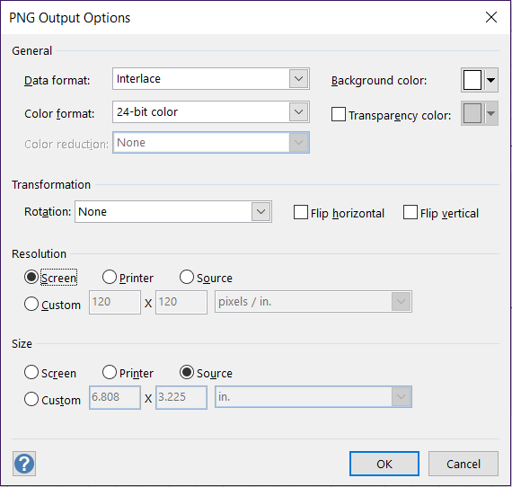
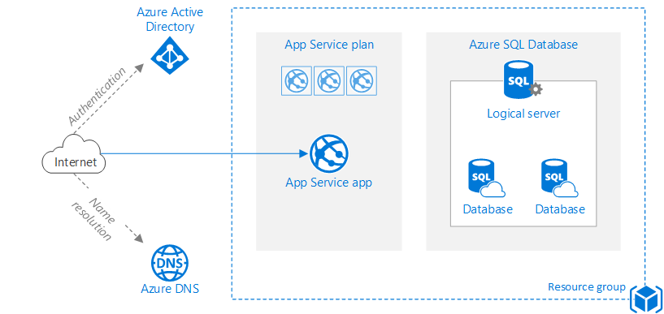
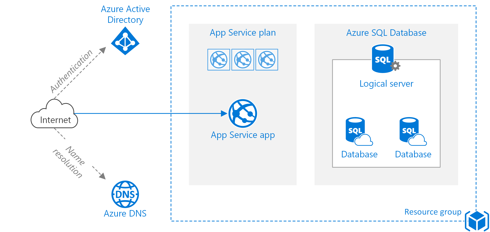
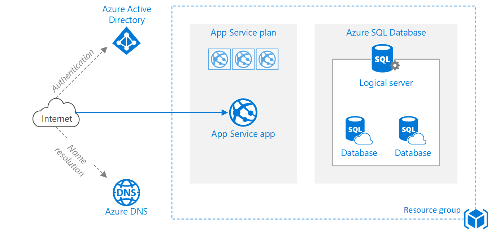
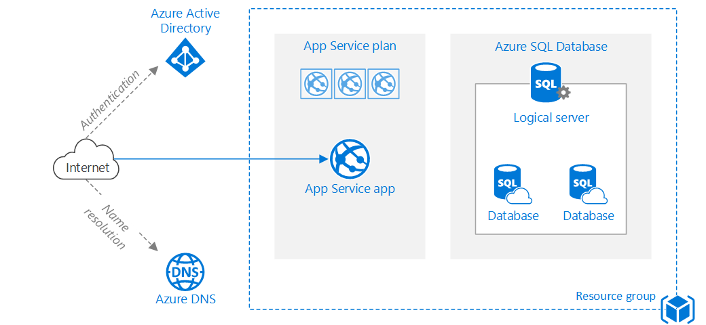
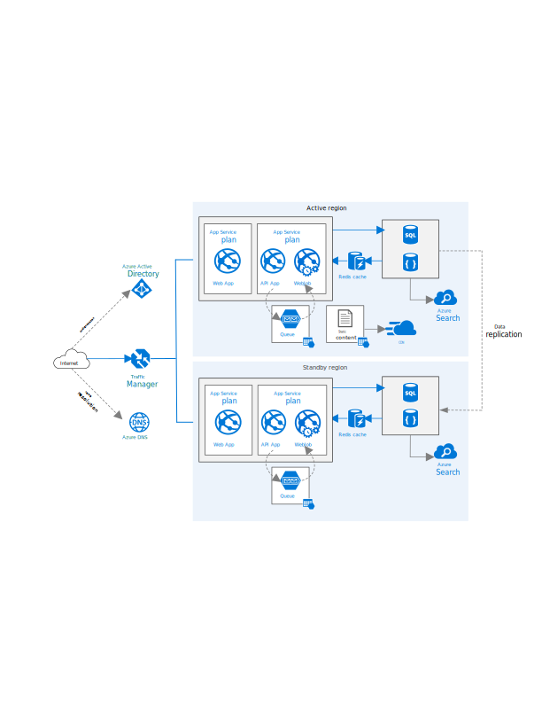

# Basic web application - DIAGRAM RESOLUTION EXAMPLES
[!INCLUDE [header](../../-includes/header.md)]

This reference architecture shows a set of proven practices for a web application that uses [Azure App Service][app-service] and [Azure SQL Database][sql-db]. [**Deploy this solution.**](#deploy-the-solution)

## Visio dialog box for Export to PNG

### General Settings:

- **Data format:** All images use _Interlace_ unless otherwise specified.
- **Color format:** All images use _24-bit color_ unless otherwise specified.
- **Color reduction:** All images use _None_ unless otherwise specified.

### Resolution settings:

- **Screen:** Dependent on the current display resolution. Two examples are provided from two different test PCs below.
- **Printer:** Dependent on the DPI resolution of the PC's default printer (600 DPI on both test PCs). 
- **Source:** In my tests, Source yielded the same results as Screen on both test PCs.
- **Custom:** A custom setting, such as 400 x 400.

### Size settings:

Unless otherwise noted, all diagrams were created with the default Source option selected; size shown was 6.808 x 3.225 inches.

## PNG: Resolution = Screen (Lenovo Thinkpad)

- Resolution: 120 pixels/inch
- Dimensions: 817 x 387
- Size: 28k
 
## PNG: Resolution = Screen (Surface Pro 4)

- Resolution: 192 pixels/inch 
- Dimensions: 1308 x 620
- Size: 53k

## PNG: Resolution = Printer

- Resolution: 600 pixels/inch
- Dimensions: 4085 x 1935 
- Size: 239k

## PNG: Resolution = Custom, 300 pixels/inch

- Resolution: 300 pixels/inch
- Dimensions: 2043 x 968
- Size: 97k

## PNG: Resolution = Custom, 400 pixels/inch

- Resolution: 400 pixels/inch
- Dimensions: 2723 x 1290 
- Size: 141k

## PNG: Resolution = Custom, 400 pixels/inch; Size = Custom, 3.4 x 1.6 inches

- Resolution: 400 pixels/inch
- Dimensions: 1360 x 640
- Size: 54k

## PNG: Resolution = Custom, 400 pixels/inch; Size = Custom, 2.6 x 1.2 inches

- Resolution: 400 pixels/inch
- Dimensions: 1040 x 480
- Size: 37k

## PNG: Resolution = Custom, 400 pixels/inch; Color = 256 color adaptive

- Resolution: 400 pixels/inch
- Dimensions: 2723 x 1290
- Size: 86k

## SVG: Standard markdown syntax 

- Resolution: Scalable
- Size: 126k

## (Template)

## PNG: Resolution = 

- Resolution:  pixels/inch
- Dimensions:  x 
- Size: k
